# Laporan Proyek Machine Learning - Muhammad Gilang Ramadhan

## Domain Proyek

Proyek ini berfokus pada pengembangan sistem prediksi tarif taksi menggunakan teknik predictive analytics, yang bertujuan untuk memperkirakan biaya perjalanan taksi berdasarkan berbagai faktor yang mempengaruhinya. Tarif taksi merupakan salah satu komponen penting dalam layanan transportasi yang bergantung pada sejumlah variabel, seperti jarak perjalanan, waktu tempuh, jumlah penumpang, serta kondisi lalu lintas dan cuaca di sepanjang rute. Oleh karena itu, penting untuk memiliki sistem yang mampu secara akurat memprediksi tarif berdasarkan data yang tersedia.

Dengan semakin berkembangnya taksi berbasis aplikasi, kebutuhan untuk menetapkan tarif yang transparan dan akurat menjadi semakin krusial. Hal ini tidak hanya bermanfaat bagi penumpang yang ingin mendapatkan estimasi biaya perjalanan, tetapi juga untuk operator taksi yang ingin memastikan tarif yang dikenakan mencerminkan kondisi lapangan secara real-time.

- Masalah utama yang dihadapi dalam industri taksi dan ride-hailing adalah penetapan tarif yang adil dan akurat. Tarif taksi yang dihitung secara manual atau menggunakan estimasi kasar dapat berisiko menimbulkan ketidakpuasan dari pelanggan dan dapat merugikan perusahaan penyedia layanan transportasi. Selain itu, kondisi lalu lintas yang tidak stabil, perbedaan harga bahan bakar, serta faktor cuaca dapat mempengaruhi biaya perjalanan, sehingga penting untuk memiliki sistem prediksi yang bisa mengakomodasi berbagai variabel tersebut dengan lebih tepat.

## Business Understanding

Dalam proyek ini, tujuan utama adalah memahami bagaimana tarif taksi dapat diprediksi secara akurat menggunakan data perjalanan. Untuk mencapai tujuan tersebut, langkah pertama adalah mengklarifikasi masalah yang ingin diselesaikan melalui model prediktif.

### Problem Statements

Menjelaskan pernyataan masalah latar belakang:

- Pernyataan Masalah 1
  Saat ini, penetapan tarif taksi seringkali tidak transparan bagi pelanggan dan dapat berubah-ubah tergantung pada berbagai kondisi seperti lalu lintas dan durasi perjalanan. Hal ini dapat menimbulkan ketidakpuasan pelanggan terhadap layanan yang diberikan.
- Pernyataan Masalah 2
  Perusahaan transportasi membutuhkan cara yang efisien dan akurat untuk memperkirakan tarif perjalanan guna menghindari kerugian serta menjaga kepuasan pelanggan tanpa harus menetapkan tarif secara statis atau berdasarkan perkiraan manual.
- Pernyataan Masalah 3
  Belum adanya sistem prediksi berbasis data historis yang mampu menggabungkan berbagai faktor perjalanan (seperti jarak, durasi, tarif per menit dan per kilometer) membuat perusahaan sulit mengambil keputusan berbasis data dalam pengelolaan tarif.

### Goals

Menjelaskan tujuan dari pernyataan masalah:

- Jawaban pernyataan masalah 1
  Mengembangkan model prediksi tarif taksi yang transparan dan berbasis data agar pelanggan dapat mengetahui estimasi biaya sebelum memulai perjalanan.
- Jawaban pernyataan masalah 2
  Menyediakan solusi analitik bagi perusahaan transportasi dalam memperkirakan tarif secara dinamis berdasarkan variabel-variabel penting seperti jarak dan durasi perjalanan.
- Jawaban pernyataan masalah 3
  Membangun sistem prediktif yang mampu mengolah data historis perjalanan dan menghasilkan prediksi tarif dengan tingkat akurasi tinggi, sehingga mendukung pengambilan keputusan yang lebih tepat.

## Data Understanding

Dataset yang digunakan dalam proyek ini diperoleh dari platform Kaggle. Dataset ini berisi informasi lengkap mengenai perjalanan taksi, termasuk jarak tempuh, tarif dasar, tarif per kilometer, tarif per menit, durasi perjalanan, jumlah penumpang, serta harga akhir dari perjalanan (Trip Price). Data ini sangat relevan untuk keperluan prediksi harga karena mencakup variabel-variabel utama yang memengaruhi tarif perjalanan. Dataset ini memungkinkan untuk dilakukan eksplorasi, pembersihan data, hingga pembangunan model prediktif yang dapat memberikan estimasi harga secara akurat berdasarkan input dari fitur-fitur tersebut. Contoh: [Kaggle](https://www.kaggle.com/datasets/denkuznetz/taxi-price-prediction/data).

### Variabel-variabel pada Taxi Price Prediction pada Kaggle sebagai berikut:

- Trip_Distance_km: Jarak tempuh dari perjalanan dalam satuan kilometer.
- Passenger_Count: Jumlah penumpang yang melakukan perjalanan dengan taksi.
- Base_Fare: Tarif dasar yang dikenakan untuk setiap perjalanan, terlepas dari jarak atau waktu tempuh.
- Per_Km_Rate: Tarif yang dikenakan per kilometer selama perjalanan berlangsung.
- Per_Minute_Rate: Tarif yang dikenakan per menit selama perjalanan berlangsung.
- Trip_Duration_Minutes: Durasi perjalanan yang dihitung dalam satuan menit.
- Trip_Price: Harga akhir atau total tarif yang harus dibayarkan oleh penumpang (merupakan target variabel).
- Time_Of_Day: Waktu dari perjalanan dimulai seperti (Morning, Afternoon, Evening, or Night).
- Day_Of_Week: Hari dimana orang melakukan perjalanan Weekday or Weekend.
- Traffic_Conditions: Lalu lintas selama perjalanan (Low, Medium, High).
- Weather: Cuaca yang dilalui selama perjalanan (Clear, Rain, Snow).

- Melakukan df.info() untuk mendapatkan informasi mengenai ada berapa data didalam dataset

  - Dataset ini terdiri dari 7 fitur dengan data numerik (float)
  - Dataset ini juga memiliki 4 fitur dengan data kategorikal (object)
  - Setelah dilakukan df.info() dataset ini terdeteksi memiliki data null atau kosong dikarenakan data yang tersedia ada pada awalnya itu 1000 data namun untuk data yang terdeteksi non-null itu ratarata memiliki 950 data setiap fiturnya terkecuali fitur Trip_Price yang memiliki 951 data non-null

- Melakukan df.describe() untuk lebih mengetahui nilai rata-rata, standar deviasi, min dari data serta 25%,50%,75%,dan max dari data numerik yang tersedia

  - Dari pengecekan data numerik dengan df.describe() dapat diduga beberapa fitur memiliki nilai outliers yang harus dibersihkan

- Melakukan visualisasi barchart untuk data kategorikal dan correlation matrix untuk data numerik

  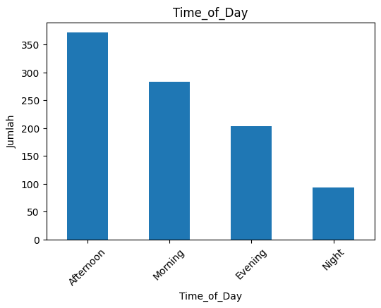

  - Berdasarkan hasil visualisasi BarChart pada fitur Time_of_Day, terlihat bahwa waktu afternoon adalah periode yang paling sering digunakan oleh pengguna untuk memesan taksi dengan persentase sebanyak 39.1%
    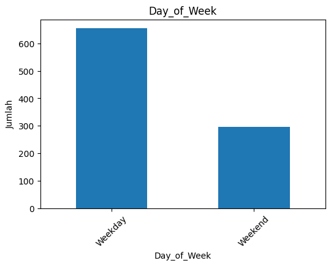
  - Berdasarkan visualisasi BarChart pada fitur Day_of_Week, dapat dilihat bahwa pengguna lebih sering memesan taksi pada hari Weekday dibanding Weekend dengan persentase sebesar 68.9%
    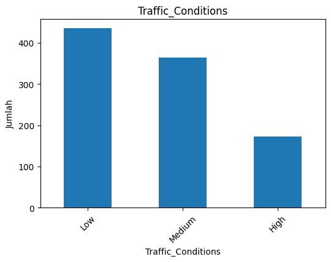
  - Dari hasil visualisasi BarChart pada fitur Traffic_Conditions itu pengguna lebih menyukai atau lebih sering memesan taksi dengan lalu lintas yang rendah dengan persentase mencapai 41.8%
    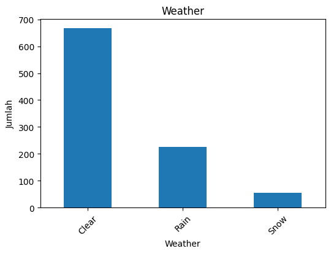
  - Dan pada visualisasi BarChart fitur Weather pengguna juga menyukai cuaca yang Clear yang dimana cuaca tersebut memiliki persentase 70.2% sangat tinggi dibandingkan dengan cuaca lainnya seperi Rain dan Snow
    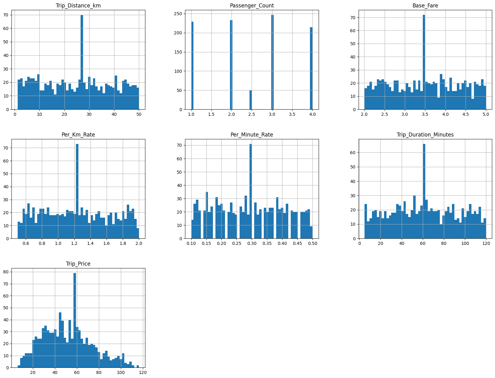
  - Pada visualisasi ini Trip_Price yang akan digunakan sebagai target memiliki nilai puncak yang lebar di angka 40-60. Namun puncaknya itu di angka 50

  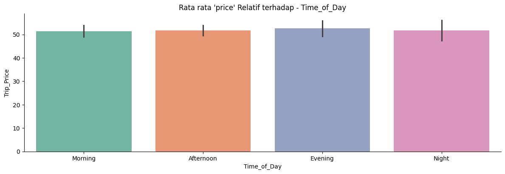
  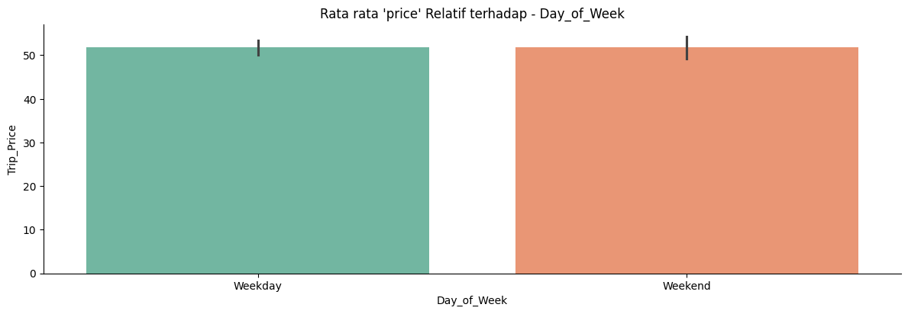
  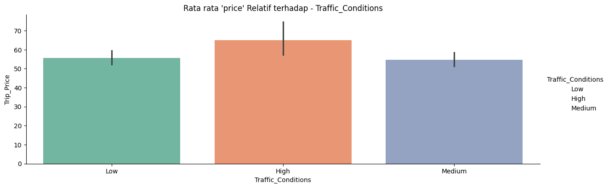
  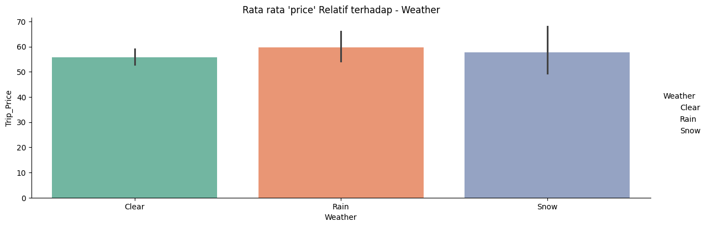

  - Dilihat dari ke empat hasil barplot ini bisa dibilang untuk fitur kategorikal tidak ada satupun fitur yang mempengaruhi target (Trip_Price) karena dari ke empat fitur ini menunjukkan hasil yang sama tidak ada yang berbeda dan tidak ada fitur yang relatif ke fitur target (Trip_Price)

  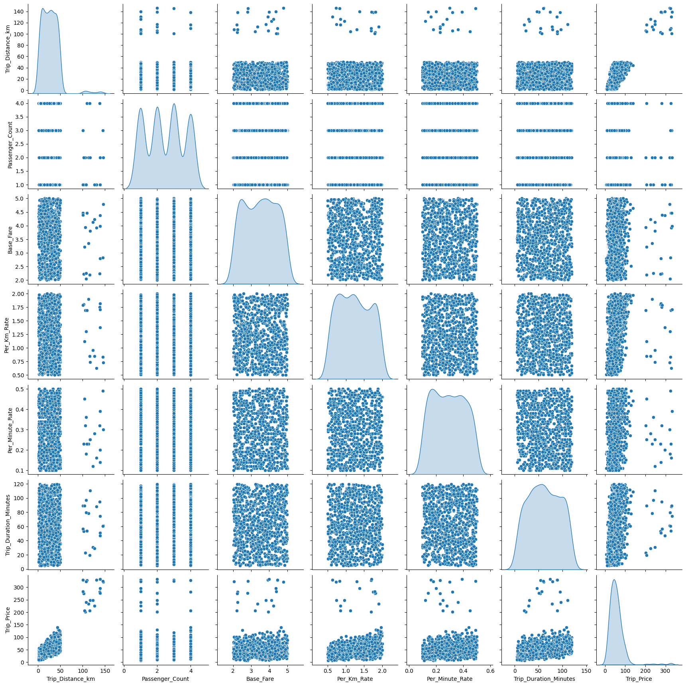
  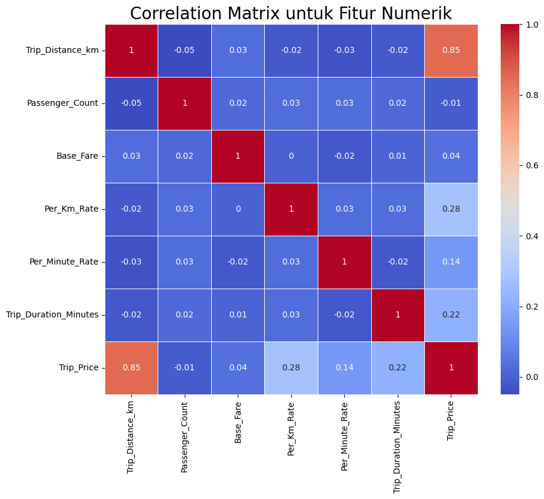

  - Dari hasil visualisasi Pair Plot dan Correlation Matrix dapat dilihat bahwa fitur numerik Trip_Distance_km itu memiliki hubungan yang erat dengan fitur target (Trip_Price) dengan angka kedekatan 0.85 disusul oleh Per KM Rate, Per Minute Rate, Trip Duration Minutes

## Data Preparation

Pada bagian ini hal pertama yang dilakukan adalah menangani missing values, menangani nilai outliers, melakukan encoding pada data kategorikal, memisahkan data yang telah bersih ke dua bagian yaitu training set dan test set serta melakukan standarisasi agar ketika pemodelan lebih mudah dan meningkatkan angka akurasi pada pemodelan

- Menangani Missing Values dan Duplikasi Data

  - Seperti dugaan sebelumnya dataset ini memiliki missing values sebanyak 50 data pada setiap fiturnya terkecuali pada fitur target Trip_Price ini hanya memiliki 49 data
  - Untuk data numerik diisi dengan nilai ratarata atau mean pada setiap fitur yang memiliki missing values
  - Untuk data kategorikal diisi dengan nilai yang sering muncul atau modus pada setiap fitur yang memiliki missing values
  - Namun untuk duplikasi data ini terdeteksi kosong tidak ada data yang duplikat pada dataset ini

- Menangani Nilai Outliers
  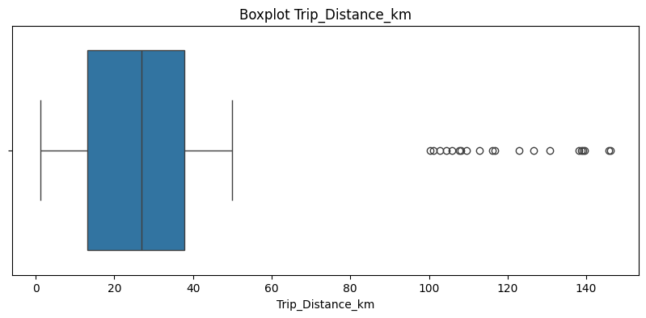

  - Dilihat pada grafik boxplot ini fitur Trip Distance KM (Jarak Perjalanan berdasarkan KM) ini memiliki banyak outliers yang harus diperbaiki
  - Nilai outliers diatasi dengan menggunakan metode IQR Range agar data lebih seimbang dan tidak ada nilai outliers

- Melakukan encoding dengan metode one-hot encoding pada setiap data kategorikal ini diperlukan agar model dapat memproses data-data kategorikal
- Membagi data menjadi 2 bagian Training set dan Testing dalam projek ini saya membagi data training dan test dengan skala 80:20 jadi untuk data training sendiri memiliki jumlah data 777 dari 972 dan test sendiri memiliki data dengan jumlah 195 dari 972
- Membagi data menjadi 2 bagian Training set dan Testing set ini sangat diperlukan untuk dilakukannya pelatihan pada pemodelan serta melakukan validasi menggunakan testing set yang telah ditentukan pada pemodelan oleh karena itu training set dan testing set ini diperlukan dan tidak bisa dipisahkan
- Selanjutnya melakukan standarisasi pada setiap fitur X yang tidak memiliki fitur target dikarenakan setiap fitur memiliki skala yang berbeda oleh karena itu diperlukan standarisasi agar model dapat belajar lebih cepat dan stabil, dan performanya lebih akurat

## Modeling

Pada projek ini saya menggunakan 4 model seperti: RandomForestRegressor,XGBRegressor,Suppor Vector Regression, Linear Regression

- Pada RandomForestRegressor menggunakan parameter dengan RandomForestRegressor(n_estimators=100, max_depth=10, min_samples_split=10, min_samples_leaf=5, random_state=64, n_jobs=-1)
- Cara kerja:
  Random Forest bekerja dengan membangun banyak pohon keputusan (decision trees) pada data yang berbeda-beda (menggunakan teknik bootstrap sampling), lalu menggabungkan hasil prediksi masing-masing pohon untuk mendapatkan prediksi akhir. Dengan pendekatan ini, Random Forest mampu mengurangi risiko overfitting yang umum terjadi pada single decision tree.

- Lalu pada XGBRegressor menggunakan parameter seperti ini XGBRegressor(n_estimators=20, max_depth=3, random_state=64, n_jobs=-1)
- Cara kerja:
  XGBoost (Extreme Gradient Boosting) bekerja dengan membangun model secara bertahap. Setiap model baru berusaha untuk memperbaiki kesalahan dari model sebelumnya menggunakan teknik boosting. XGBoost juga mengoptimalkan kecepatan dan performa dengan regularisasi sehingga mampu mengatasi overfitting lebih baik dibanding metode boosting biasa.

- SVR pada model ini menggunakan parameter seperti SVR(kernel='linear', C=200, epsilon=0.1)
- Cara kerja:
  SVR berusaha mencari garis regresi terbaik di mana sebagian besar data berada dalam batasan toleransi tertentu (epsilon). Model ini mencoba memaksimalkan margin antara data yang diprediksi dan garis regresi, serta menggunakan parameter C untuk mengontrol trade-off antara margin lebar dan error kecil.

- Terakhir Linear Regression tidak menggunakan parameter apapun dikarenakan Linear Regression adalah model yang sangat simpel dibanding yang lainnnya
- Cara kerja:
  Linear Regression bekerja dengan mencari garis lurus terbaik yang meminimalkan jumlah error kuadrat antara prediksi dan nilai aktual. Model ini mengasumsikan hubungan linear antara variabel input (X) dan target (y).

Kelebihan:
Mampu menangani data kompleks, tidak mudah overfitting jika diatur dengan baik, dan dapat menangani outlier serta missing value.
Kekurangan:
Waktu pelatihan cukup lama dan hasilnya kurang interpretatif dibanding model linear.

- XGBRegressor
  Parameter: n_estimators=20, max_depth=3, random_state=64, n_jobs=-1

Kelebihan:
Memiliki performa yang kuat untuk data tabular dan dapat mengatasi overfitting dengan pengaturan parameter yang baik.
Kekurangan:
Cukup sensitif terhadap parameter, dan butuh tuning yang tepat agar hasilnya optimal.

- SVR
  Parameter: kernel='linear', C=200, epsilon=0.1

Kelebihan:
Cocok untuk dataset yang tidak terlalu besar, dan cukup efektif pada data linear jika kernel yang tepat digunakan.
Kekurangan:
Tidak cocok untuk dataset besar karena waktu komputasinya tinggi. Performanya menurun jika data tidak diskalakan dengan baik.

- Linear Regression
  Parameter: Tidak menggunakan parameter tambahan

Kelebihan:
Model sederhana, cepat untuk dilatih, dan mudah untuk diinterpretasikan.
Kekurangan:
Kurang fleksibel, tidak cocok untuk hubungan non-linear antara fitur dan target.

- Dalam proyek ini, model yang terpilih sebagai model terbaik adalah XGBRegressor.
  Alasan pemilihannya adalah karena performa model ini menunjukkan hasil yang stabil antara data pelatihan (train) dan data pengujian (test).
  Pada XGBRegressor, nilai loss pada data train adalah 0.046954, sedangkan pada data test adalah 0.055451.
  Perbedaan antara kedua nilai ini sangat kecil, yang menandakan bahwa model tidak mengalami overfitting (terlalu bagus di train tapi jelek di test) ataupun underfitting (buruk di train dan test).

Hal ini menunjukkan bahwa XGBRegressor mampu belajar pola dari data dengan baik dan mampu menggeneralisasi ke data baru yang belum pernah dilihat sebelumnya.
Dengan hasil ini, kita bisa menyimpulkan bahwa XGBRegressor mendekati model ideal karena gap antara performa training dan testing sangat kecil sehingga model dapat diandalkan untuk membuat prediksi harga taksi secara akurat.

## Evaluation

Dalam proyek ini, metrik evaluasi yang digunakan adalah Mean Squared Error (MSE).
MSE digunakan untuk mengukur seberapa jauh prediksi model dibandingkan dengan nilai aktual, dengan menghitung rata-rata kuadrat dari selisih keduanya.
Semakin kecil nilai MSE, berarti model semakin akurat dalam memprediksi tarif taksi.

- Mengapa memilih MSE?
  Karena permasalahan ini adalah masalah regresi (memprediksi nilai tarif yang kontinu), maka MSE menjadi pilihan metrik yang tepat.
  MSE mampu memberi penalti lebih besar pada prediksi yang jauh dari nilai sebenarnya, sehingga membantu model lebih fokus untuk mengurangi error yang besar.

- Model terbaik dalam proyek ini adalah XGBRegressor, dengan nilai MSE pada data training sebesar 0.046954 dan pada data testing sebesar 0.055451.
  Perbedaan nilai MSE antara data training dan testing sangat kecil, menunjukkan bahwa model ini stabil dan mampu melakukan generalisasi dengan baik ke data baru.

Evaluasi model ini menunjukkan bahwa solusi yang dibangun berhasil menjawab setiap problem statement yang telah ditetapkan:

Problem Statement 1:
Model prediksi ini memberikan estimasi tarif yang lebih transparan kepada pelanggan sebelum perjalanan dimulai, sehingga meningkatkan kepuasan pelanggan.

Problem Statement 2:
Perusahaan transportasi kini dapat menggunakan model ini untuk memperkirakan tarif perjalanan secara dinamis dan berbasis data, bukan lagi perkiraan manual.

Problem Statement 3:
Dengan memanfaatkan data historis seperti jarak, durasi, dan waktu, model ini berhasil menghasilkan prediksi tarif yang akurat, mendukung pengambilan keputusan berbasis data.

Kesimpulan:
Proyek ini berhasil mencapai goals yang telah ditentukan pada tahap Business Understanding.
Model prediktif yang dihasilkan dapat memberikan manfaat nyata bagi pelanggan maupun perusahaan transportasi dalam menentukan tarif taksi dengan lebih akurat dan adil.

- Mean Squared Error (MSE) sendiri adalah metrik yang digunakan untuk mengukur seberapa besar kesalahan rata-rata dari hasil prediksi model terhadap nilai sebenarnya. Metrik ini sering digunakan dalam masalah regresi seperti memprediksi harga.

- Model akan menghitung selisih antara nilai prediksi dan nilai asli, lalu mengkuadratkan selisih tersebut (agar tidak ada angka negatif). Semua selisih yang sudah dikuadratkan dijumlahkan, lalu dirata-ratakan. Semakin kecil nilai MSE, berarti hasil prediksi semakin mendekati nilai sebenarnya.

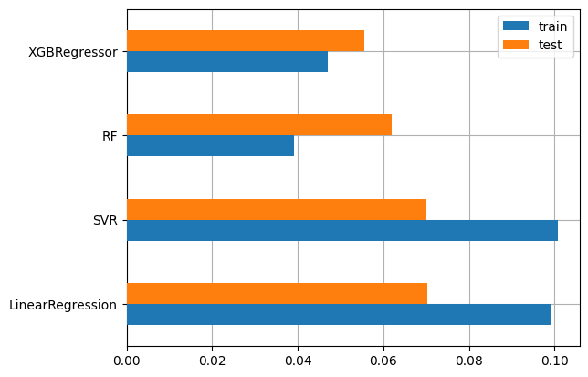
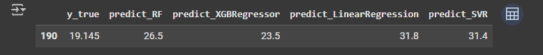
